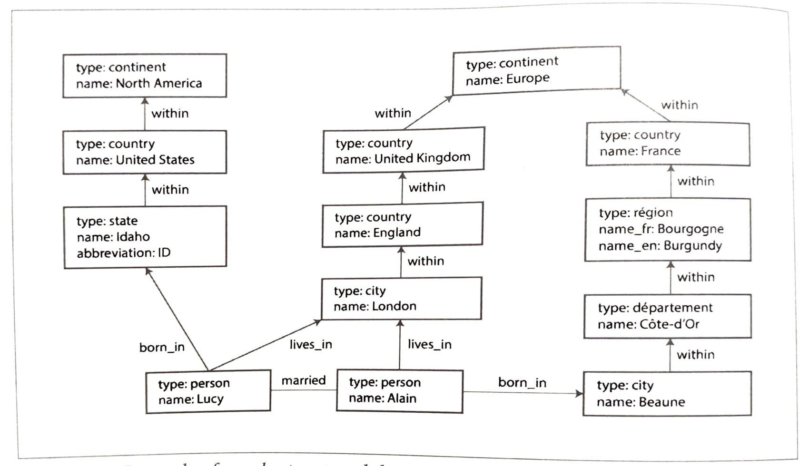

- In this chapter we will see what are data models, what are different types of models are used to design application, pros and cons of each models, etc.
- The term **_DATA MODEL_** refers to the way data is organized, documented and defined within a database.
- Most application are built by different layers. Each layer is a different data model. For each layer, the key question is: how is it represented in terms of the next-lower layer?
- For example:
  1.  Application developer looks real worlds and models it in terms of objects or data structure, and APIs that manipulate those data structure. -> Most developer are on this layer (said by Sunny not me)
  2.  Expressing the data structure in terms of a general-purpose data models, such as JSON or XML documents, tables in relation db or different models
  3.  Gigachads who build your database software decided on a way of representing that JSON/XML/relation/graph in terms of bytes in memory,disk or on network. Iski help se we can query,search, manupilate and process data in various ways
  4.  Now, more Alpha gigachads are hardware engineers who has figured out how to represent bytes in terms of electrical currents, pulses of light, and more.
- Different types of data models in book:
  1.  Relational models : organizes data into tables (relations) consisting of rows (tuples) and columns (attributes), enabling structured storage and efficient retrieval
  2.  Document models : stores data as flexible, self-describing documents—typically in formats like JSON or XML—allowing for dynamic schemas and hierarchical structures
  3.  Graph-like models : structures data as nodes (entities) and edges (relationships), allowing for efficient representation and querying of interconnected information.
- **Relation V/S Document model:**
  - Relation model was proposed by Edgar Codd in 1970. Many people doubted whether it could be implemented efficiently. But, in mid 1980 SQL become tool of choice for most people.
  - In upcoming many years many different models came like network model and hierarchical model in 1970s and early 1980s, Object databases in late 1980s and early 1990s, XML database in early 2000s.
  - Each competitor to the relation model generated a lot of hype in its time, but it never lasted (because SQL is Kratos of Databases 💪🏻)
  - **_Birth of NoSQL_**
    - In 2010s a Twitter hashtag #NoSQL was trending for a meetup on open-source, distributed, nonrelational database. (it has been retroactively reinterpreted as *Not Only SQL*)
    - _This was how the NoSQL database was born._
    - NoSQL was having its own pros:
      1.  Greater and easily scalable.
      2.  Specialized query operations that are not supported by relation models
      3.  Desire for more dynamic & expressive data model
  - Polygot Persistence: Using nonrelational datastore within relational databases
  - **_Object-Relation Mismatch_**
    - The application we are developing uses object to store data of user, where as in DB we store in relational tables.
    - So, to avoid this impedance mismatch(disconnect between models) a translation layer is required.
    - ORMs (Object-relational mapping) frameworks reduce the amount of boilerplate code required for this translation layer.
    - Today's ORMs are so advance that they can perform the same task across different data models (ORMs examples: Java[Hibernate], JS[Prisma], Python[SQLAlchemy], GO[GORM])
    - For Example let's see how to store resume:
      - Relational: 
        - Here each profile has its unique identifier, `user_id`. Fields like `first_name` and `last_name` apper exactly once per user, so they have a seprate columns on the user table.
        - But, most people have more than one job, people may have varying number of periods of education and many more details can be more than one.
        - Thus, one-to-many relationship from user to these items. These can be represented as:
          1.  (Prior to SQL:1999) Most common ways is normalization. Put positions, education and contact information in separate tables, with a foreign key referencing to `users` table.
          2.  Newer SQL standards support structured types, XML, and JSON for multi-valued data storage, with querying/indexing in databases like Oracle, DB2, SQL Server, MySQL, and PostgreSQL.
          3.  Third option to encode jobs, education and contact info as a JSON or XML. Store then in text in db, and let application interpret its structure and content. (In this you typically cannot use the database to query for values inside that encoded column.)
      - Document:
        ```json
        {
          "user_id": 251,
          "first_name": "Bill",
          "last_name": "Gates",
          "summary": "Co-chair of the Bill & Melinda Gates... Active blogger.",
          "region_id": "us:91",
          "industry_id": 131,
          "photo_url": "/p/7/000/253/05b/308dd6e.jpg",
          "positions": [
            {
              "job_title": "Co-chair",
              "organization": "Bill & Melinda Gates Foundation"
            },
            { "job_title": "Co-founder, Chairman", "organization": "Microsoft" }
          ],
          "education": [
            { "school_name": "Harvard University", "start": 1973, "end": 1975 },
            {
              "school_name": "Lakeside School, Seattle",
              "start": null,
              "end": null
            }
          ],
          "contact_info": {
            "blog": "https://www.gatesnotes.com/",
            "twitter": "https://twitter.com/BillGates"
          }
        }
        ```
        - JSON representation offers better locality than a multi-table schema, needing just one query instead of multiple queries or complex joins.
  - **_Many-to-One and Many-to-Many Relationships_**
    - As we see in above example `region_id` and `industry_id` are given as Ids, not as plain-text. Because this help in:
      1. Consistenct style and spelling across profile
      2. Avoiding ambigutiy (like Banglore, Bengluru, Greater Bengluru Area)
      3. Ease of updating - all are stored in only one place, so easy to update
      4. Localization support — when the site is translated into other languages
      5. Better search — e.g., a search for Senior Director at JioHotstar you will get Sunny's Profile
    - This is help in cases when humans may need to change to be something and if the information is duplicated, all the redundant copies need to be updated.
    - Removing such duplication is the key idea behind normalization in databases.
    - Thus, normalizing this data require _many-to-one_ relationships, which don't fit nicely into document models.
    - Moreover, when adding new features (like Organization, schools, Recommendations, etc.) require _many-to-many_ relationships.
      
  - **_Are Document Databases Repeating History?_**
    - Before the birth of NoSQL databases, in 1970s IBM's _Information Management System_ (IMS), developed stock-keeping for Apollo space programs.
    - Design of IMS used simple data model called _hierarchical model_, similar t0 JSON model in document databases.
    - IMS was also not able to work well with many-to-many relationships.
    - To solve those issue two prominent solution we proposed, _Relational Model_ (which become SQL) and the _Network Model_.
    - **Network Model**
      - This model was standardized by commitee called _Conference of Data Systems Languages_ (CODASYL). Later the model was know as CODASYL Model
      - CODASYL Model was generalization of hierarchical model. But, unlike tree structure with exactly one parent node, a record could have multiple parents.
      - This allowed many-to-one & many-to-many relationships.
      - Here the link between records were pointers.
      - So, the only way to access the record was through _access path_. (Path from root to the destination record is _Access Path_).
      - In simple words this is like traversal of linked lis: start at the head of the list, and look each record until you find your destination record.
      - But, in many-to-many relationships there can be multiple access paths to the same records, and a programmer working with this has to keep track of these different access paths.
      - Even CODASYL commitee members admitted that this was like navigating around an _n-dimensional_ data space.
      - Further, manual access path selection was introduced to make most efficient use of very limited hardware capabilities (such as tap drivers).
      - But querying and updating the database was still complicated and inflexible.
    - **Relational Model**
      - Here, all the data was simply laied out in tables (relations) and tuples (rows).
      - This model made reading and writing of data in a particular row so easy.
      - The query optimizer automatically decides which parts of the query to execute in which order, and which indexes to use.
      - Those choices are effectively the “access path,” but made automatically by the query optimizer, not by the developer.
      - If you want to query your data in new ways, declare a new index, and queries will automatically use whichever indexes are most appropriate.
      - This made relational model much easier to add new features to application.
- **Relation V/S Document Databases Today:**

  - Main argument in favour of document data model are schema flexibility, better performance due to locality.
  - In Favour of relation data model are providing bettwe support for joins, and many-to-many relationships.
  - **_Which data model leads to simpler application code?_**
    - Document Database:
      - If data has a document like structure (i.e. tree of one-to-many relationships, where entire tree is loaded at once)
      - Limitations, cannot refer directly to a nested item within document.
      - Poor support for joins, this may or may not be a problem as it depends on the application.
    - Relational Database:
      - If data has to be splitted into a multiple table (i.e. if the data has many-to-one or many-to-many relationships)
      - Limitations, sometime schemas gets difficult to understand and unnecessary complication in application code.
    - But, it is not possible to say in general which data model leads to simpler application code.
  - **_Schema flexibility in the document model_**:

    - Most document databases and the JSON support in relational databases don't enforce any schema on the data documents.
    - No schema &rarr; Arbitrary keys and values can be added to document, and when realing clients have no guarantees as to what fields the documents may contain.
    - Document database are called _schemaless_, but the more accurate term is _schema-on-read_ as the structure of data is implicit, and only interpreted when the data is read. (_Schema-on-read &rarr; Dynamic typed language_)
    - Relational database are called _schema-on-write_ as the structure of data is explicit, and the database ensures all written data conforms to it. (_Schema-on-write &rarr; Static typed language_)
    - Let's understand how much does schema flexibility affect for large application by example:

      - Consider an application is designed where initially the `NAME` of the user was stored.
      - Now the architecture wants to store the First Name (`FNAME`) & Last Name (`NAME`) separately.
      - Case 1: If it is document database:
        - We can add an application code that splits the `NAME` into `FNAME` and `NAME` when user is login.
          ```
          if(user && user.name && !user.fname){
            user.fname = user.name.split(" ")[0];
          }
          ```
      - Case 2: If it is relation database:

        - For relation database we can obtain the same results in two different methods:

          - Method 1: Perform a migration and change the schmea of the database.
            ```SQL
            ALTER TABLE users ADD COLUMN fname text;
            UPDATE users SET fname = split_part(name, ' ' , 1); -- PostgreSQL
            UPDATE users SET fname = substring_index(name, ' ' , 1); -- MySQL
            ```
          - Method 2: Alter table to add a new column and split the `NAME` when user login.

            ```SQL
            ALTER TABLE users ADD COLUMN fname text;
            ```

            ```python
            def login_check(userId: str, password: str) -> bool:
              ...

            if login_check("namra4122","asdf!@#"):
              query = """UPDATE users SET FNAME = %s, LNAME = %s WHERE id = %s"""
              cursor.execute(query, (user.name.split(" ")[0], user.name.split(" ")[1], userId))

            ```

  - **_Data Locality for queries_**:
    - Documents are stored as single continuous strings using formats like JSON/XML or binary (e.g., MongoDB's BSON).
    - Pros:
      - Efficient for applications needing entire documents, reducing disk seeks and improving performance.
    - Cons:
      - Inefficient for partial data access due to full document loading.
      - Updates often require rewriting the entire document, which is resource-intensive for large files.
    - Similar Concepts in Other Databases :
      - Spanner: Interleaved tables.
      - Oracle: Multi-table index cluster tables.
      - Bigtable/Cassandra/HBase: Column-families for data locality.
  - **_Convergence of document and relational databases_**:
    - Many relational databases have supported XML since the mid-2000s, offering features like local XML modifications and querying capabilities.
    - PostgreSQL (9.3+), MySQL (5.7+), and IBM DB2 (10.5+) support JSON, with other relational databases expected to follow due to web API trends.
    - Document Databases Embracing Relational Features:
      - RethinkDB supports relational-like joins.
      - MongoDB drivers offer client-side reference resolution, though less efficient than server-side joins.
    - Advantages of Hybrid Models: Combining document and relational features allows applications to choose the best fit for their needs, with a future trend towards hybrid database models.

- **Query Language for Data:**

  - To query relational database we use _declarative queries_, whereas for CODASYL and document databases we use _imperative queries_.
  - What are _declarative_ and _imperative_ queries:
    - Declarative: Code or queries in which you just specify the pattern of the data you want, you don't have to think of any low level implementation for that action.
    - Imperative: Code or queries in which you tells the computer to perform certain operations in a certain order, you have to take care of evaluation conditions, updating variables, etc..
  - Example of _declarative_ and _imperative_ codes:

    - Declarative:
      ```SQL
      SELECT * FROM animals WHERE family = 'Sharks';
      ```
    - Imperative:

      ```python
      def getSharks():
        sharks = []
        for i in animals:
          if i.family == "Sharks":
            sharks.append(i)

        return sharks
      ```

  - Pros and Cons _declarative_ and _imperative_ codes:
    - Declarative:
      - Pros:
        - More concise and easier to work with
        - Hides implementation details from the user, allowing for performance improvements without changing the query
        - Can be optimized for parallel execution across multiple cores or machines
        - Less prone to errors due to its simpler syntax
      - Cons:
        - Limited functionality compared to imperative code
        - May not provide fine-grained control over the query execution
    - Imperative:
      - Pros:
        - Provides more control over the query execution, allowing for complex logic and conditional statements
        - Can be used to implement custom algorithms or data transformations
      - Cons:
        - More verbose and harder to read and maintain
        - Ties up system resources and can be slower due to the need to evaluate conditions and update variables
        - May not be easily optimized for parallel execution across multiple cores or machines
  - **_Declarative Queries on the Web_**:

    - Declarative query language are not limited to just databases.
    - To understand more lets compare declarative and imperative in a web browser:

      - Task: The user is currently viewing the page on sharks, so you mark the navigatioin item "Sharks" as currently selected and highlight it in `BLUE` color.

        - Declarative approach: (Using CSS)

          ```html
          <ul>
            <li class="selected">
              <p>Sharks</p>
              <ul>
                <li>...</li>
                <li>...</li>
                <li>...</li>
              </ul>
            </li>
            <li>
              <p>Whales</p>
              <ul>
                <li>...</li>
                <li>...</li>
                <li>...</li>
              </ul>
            </li>
          </ul>
          ```

          ```css
          li.selected > p {
            background-color: blue;
          }
          ```

        - Imperative approach: (Using DOM APIs in JS)

          ```javascript
          var liElements = document.getElementsByTagName("li");
          for (var i = 0; i < liElements.length; i++) {
            if (liElements[i].className === "selected") {
              var children = liElements[i].childNodes;
              for (var j = 0; j < children.length; j++) {
                var child = children[j];
                if (
                  child.nodeType === Node.ELEMENT_NODE &&
                  child.tagName === "P"
                ) {
                  child.setAttribute("style", "background-color: blue");
                }
              }
            }
          }
          ```

    - Jaise declarative CSS styling is much better than manipulating each styles imperatively in JS. Similarly, in databases SQL are much better than imperative query APIs.

  - **_MapReduce Querying_**:
    - A programming model for procession large amounts of data in bulk across many machines.
    - Limited form of MapReduce is supported by some NoSQL datastores like MongoDB and CouchDB as a mechanism for performing read-only queries across many documents.
    - Example: Counting Sharks per Month
      - In PostgreSQL:
        ```SQL
        SELECT date_trunc('month', observation_timestamp) AS observation_month,
               sum(num_animals) AS total_animals
        FROM observations
        WHERE family = 'Sharks'
        GROUP BY observation_month;
        ```
      - In MongoDB using MapReduce:
        ```javascript
        db.observations.mapReduce(
          function map() {
            var year = this.observationTimestamp.getFullYear();
            var month = this.observationTimestamp.getMonth() + 1;
            emit(year + "-" + month, this.numAnimals);
          },
          function reduce(key, values) {
            return Array.sum(values);
          },
          { query: { family: "Sharks" }, out: "monthlySharkReport" }
        );
        ```
    - Restriction on MapReduce Functions:
      - Must be _pure function_ (_pure function_ means they only use the data that is passed to them as input)
      - Cannot perform additional database queries
      - Must not have any side effects
    - Pros of MapReduce:
      - Can parse strings, call library functions, perform calculations, and more.
      - Powerful of advanced queries.
    - Concs for MapReduce:
      - Requries writting two carefully coordinated JavaScrit.
      - No query optimizer can improve the performance of quyery
    - Declarative Query Language (Aggregation Pipeline):
      - Added to MongoDB 2.2 as an alternative to MapReduce
      - Example:
        ```javascript
        db.observations.aggregate([
          { $match: { family: "Sharks" } },
          {
            $group: {
              _id: {
                year: { $year: "$observationTimestamp" },
                month: { $month: "$observationTimestamp" },
              },
              totalAnimals: { $sum: "$numAnimals" },
            },
          },
        ]);
        ```

- **Graph-Like Data Models:**

  - When your data has more one-to-many relationships or no relationships your goto data model should be _Document model_.
  - But if your data mas too many many-to-many relationships than usual then using relation data model will be alot more complex, then it beomes more natural to start using **Graph Data Models**.
  - Graph consists of two kinds of objects:
    - _Vertices_ also known as _nodes_ or _entities_.
    - _Edges_ also known as _relations_ or _arc_.
  - You might think that all the vertices in graph will represent the same kind of data. However, graphs are not limited to such _homogeneous_ data.
  - They are equally powerful to use graphs to provide a consistent way of storing completely different tyeps of objects in single datastore.
  - Example to understand how this works:
    - Facebook maintains a asingle graph with many different types of vertices and edges: vertices represent people, locations, events, checkin, and comments made by users; edges indicate which people are friends with each other, which checkin happended in which location, who commented on which post, who attended which event, ans so on.
  - Example of graph-structure data: 
  - **_Property Graphs_**:

    - Several different ways of structuring and querying data in graphs. One of them is _Property Graphs_.
    - Here each vertex consists of: Unique identifier; Set of outgoing edges; Set of incoming edges; Collection of properties (key-value pairs)
    - Each edge consists of: Unique identifier; Tail Vertex (vertex at which the edge starts); Head Vertex (vertex at which the edge ends); Label to describe relation between two vertices; Collection of properties (key-value pairs).
    - We can use two relational table to represent a property graphs:

      ```SQL
      CREATE TABLE vertices(
        vertex_id integer PRIMARY KEY,
        properties json
      );

      CREATE TABLE edges(
        edges_id integer PRIMARY KEY,
        tail_vertex integer REFERENCES vertices (vertex_id),
        head_vertes integer REFERENCES vertices (vertex_id),
        label text,
        properties json
      );

      CREATE INDEX edges_tails ON edges (tail_vertex);
      CREATE INDEX edges_heads ON edges (head_vertex);
      ```

    - Important aspects of this model are:
      1. Any vertex can have an edge connecting it with other vertex. No schema that restrict which kind of data can or cannot be associated.
      2. Given any vertex, you can efficiently find both its incoming and its outgoing edges, and thus _traverse_ the graph.
      3. By using different labels for different kinds of relationships, you can store several different kinds of information in a single graphs.

  - **_Cypher Query Language_**:
    - _Cypher_ is a declarative query language for property graphs. (Fun fact: This langauge is named after character from movie _The Matrix_)
    - Example of Cypher Query:
      ```SQL
      CREATE
        (Asia: Location {name: 'Asia', type:'continent'}), -- VERTEX
        (India: Location {name: 'India', type:'country'}), -- VERTEX
        (Ahmedabad: Location {name: 'Gujarat', type:'state'}), -- VERTEX
        (Namra: Person {name: 'Namra'}), -- VERTEX
        (Ahmedabad) - [:WITHIN]-> (India) -[:WITHIN]-> (Asia), -- EDGE
        (Namra) -[:BORN_IN]-> (Ahmedabad) -- EDGE
      ```
    - Below codes shows how to express the query in Cypher.
      ```SQL
      MATCH
        (person) -[:BORN_IN]-> () -[:WITHIN*0..]-> (in:Location {name:'India'}),
        (person) -[:LIVES_IN]-> () -[:WITHIN*0..]-> (us:Location {name:'United States'})
      RETURN person.name
      ```
    - This query finds any vertex aka `person` that meets tthe both of the following condition:
      1. `person` has an outgoing `BORN_IN` edge to some vertex. From that vertex, follow chain of outgoing `WITHIN` edge util eventually reaches vertex with properties `type: Location` and `name: India`.
      2. Samer `person` also has an outgoing `LIVES_IN` edge. Following that edge chain of outgoing `WITHIN` edge util eventually reaches vertex with properties `type: Location` and `name: United States`.
  - **_Graph Queries in SQL_**:

    - We saw how an graph data can be represeted in a relational database.
    - But then it is very difficult to query the relation database. Becuase in relation database, we know in advance which joins needs in query.
    - In graph model we traverse variable number of edges before we find the vertex you're looking for, i.e. number of joins is not fixed in advance.
    - In our example where we search `person` who is `BORN_IN` in India and `LIVES_IN` in United States. We will use _recursive common table expressions_ to obtain the same results.

      ```SQL
      WITH RECURSIVE

        -- STEP-1
        in_ind(vertex_id) AS (
          SELECT vertex_id FROM vertices WHERE properties->>'name' = 'India'
        UNION
          SELECT edges.tail_vertex FROM edges
            JOIN in_ind ON edges.head_vertex = in_ind.vertex_id
            WHERE edges.label = 'within'
        ),

      -- STEP-2
        in_usa(vertex_id) AS (
          SELECT vertex_id FROM vertices WHERE properties->>'name' = 'United States'
        UNION
          SELECT edges.tail_vertex FROM edges
            JOIN in_usa ON edges.head_vertex = in_usa.vertex_id
            WHERE edges.label = 'within'
        ),

        -- STEP-3
        born_in_ind(vertex_id) AS (
          SELECT edges.tail_vertex FROM edges
            JOIN in_ind on edges.head_vertex = in_ind.vertex_id
            WHERE edges.label = 'born_in'
        ),

        -- STEP-4
        lives_in_usa(vertex_id) AS (
          SELECT edges.tail_vertex FROM edges
            JOIN in_usa on edges.head_vertex = in_usa.vertex_id
            WHERE edges.label = 'lives_in'
        ),

        -- STEP-5
        SELECT vertices.properties->>'name'
        FROM vertices
        JOIN born_in_ind ON vertices.vertex_id = born_in_ind.vertex_id
        JOIN lives_in_usa ON vertices.vertex_id = lives_in_usa.vertex_id;
      ```

    - Understand SQL query:
      1. Creates a recursive Common Table Expression (CTE) called `in_ind` that first finds the `vertex_id` for India and then recursively finds all vertices that are within India.
      2. Similarly creates another recursive CTE called `in_usa` that identifies the `vertex_id` for the United States and then recursively finds all vertices that are within the United States.
      3. Creates a CTE called `born_in_ind` that finds all people (vertices) who were born in India or any place within India by joining with the previously defined `in_ind` CTE.
      4. Creates a CTE called `lives_in_usa` that finds all people (vertices) who live in the United States or any place within the United States by joining with the previously defined `in_usa` CTE.
      5. Selects the names of all people who were both born in India (or a place within India) and live in the United States (or a place within the United States) by joining the vertices table with both the `born_in_ind` and `lives_in_usa` CTEs.

  - **_Triple-Stores and SPARQL_**:

    - Mostly equivalent to the property graph model.
    - Here all the information is stored in three part statement: (_subject, predicate, object_). For example, _Namra (subject), likes(predicate), Mango(object)_
    - Subject of triple is same as vertex in graph. But, an object can be:
      1. Value of a primitive datatype. For example, (_Namra, age, 22_) is like `Namra` vertex with property `{ "age": 22 }`.
      2. Another vertex in the graph. For example, (_Namra, lives, Ahmedabad_), here subject and object `Namra` and `Ahmedabad` both are vertex, and the predicate `lives` is the label of the edge.
    - Data written in triples:
      ```
      _:namra a :Person
      _:namra :name "Namra"
      _:namra :bornIn _:gujarat
      _:gujarat a :Location
      _:gujarat :name "Gujarat"
      _:gujarat :type "state"
      _:gujarat :within _:india
      _:india a :Location
      _:india :name "India"
      _:india :type "country"
      ```
    - Concise way to write triples:
      ```
      _:namra a :Person; :name "Namra"; :bornIn _:gujarat
      _:gujarat a :Location; :name "Gujarat"; :type "state"; :within _:india
      _:india a :Location; :name "India"; :type "country"
      ```
    - **The semantic web:**
      - Many people think triples and semantic web are the same thing. But, triple-store data model is completely independent of the semantic web. So, a brief discussion is needed.
      - _Semantic web_ is a fundamentallly a simple and resonable idea: instead publish information in text and picture why don't they also publish in machine-readable data.
      - _Resource Description Framework (RDF)_: a mechanism for different website to publish data in a consistent format, allowing data from different website to be automattically combined into a _web of data_.
    - **The RDF data model:**

      - RDF is written in an XML format, does the same thing but more verbose.
      - Example:

        ```XML
        <rdf:RDF xmlns="urn:example:" xmlns:rdf="http://www.w3.org/1999/02/22-rdf-syntax-ns#">

          <Location rdf:nodeID="gujarat">
            <name>Gujarat</name>
            <type>state</type>
            <within>
              <Location rdf:nodeID="india">
                <name>India</name>
                <type>country</type>
              </Location>
            </within>
          </Location>

          <Person rdf:nodeID="namra">
            <name>Namra</name>
            <bornIn rdf:nodeID="gujarat"/>
          </Person>
        </rdf:RDF>
        ```

      - RDF has a few quirks due to its design:
        - The subject, predicate, and object of a triple are often URIs.
        - For example, a predicate might be an URI such as `<http://my-company.com/namespace#within>` or `<http://my-company.com/namespace#lives_in>`, rather than just `WITHIN` or `LIVES _ IN`.
      - This is designed so that you should be able to combine your data with someone else’s data, and if attach a different meaning to the word `within` or `lives_` in, you won’t get conflict because their predicates are `<http://other.org/foo#within>` & `<http://other.org/foo#lives_in>`.

    - **The SPARQL query language:**

      - _SPARQL_ is a query language for triple-store using RDF data model.
      - For example, query for finding person born in India and lives in United States looks like:

        ```SQL
        PREFIX: <urn:example>

        SELECT ?personName WHERE {
          ?person :name ?personName
          ?person :bornIn / :within / :name "India"
          ?person :livesIn / :within / :name "United States"
        }
        ```

      - Structure is very similar with Cypher. For example:
        `(person) -[:BORN_IN] -> () -[:WITHIN*0..] -> (location)` # Cypher <br>
        `?person :bornIn / :within* ?location` # SPARQL

  - **_The Foundation: Datalog_**:

    - _DataLog's_ data model is similar to triple-store model. Instead of _(subject, predicate, object)_, here it is written as _predicate(subject, object)_.
    - For example:

      ```
      name(india, 'India')
      type(india, country)

      name(gujarat, 'Gujarat')
      type(gujarat, state)
      within(gujarat, india)

      name(namra, 'Namra')
      born_in(namra, gujarat)
      ```

    - Now if we see query to find person born in India and lives in United States:

      ```
      within_recursive(Location, Name) :- name(Location, Name).          \* RUlE 1 *\

      within_recursive(Location, Name) :- name(Location, Via),           \* RUlE 2 *\
                                          within_recursive(Via, Name)

      migrated(Name, BornIn, LivesIn) :- name(Person, Name),             \* RUlE 2 *\
                                         born_in(Person, BornLoc),
                                         within_recursize(BornLoc, BornIn),
                                         lives_in(Person, LivesLoc),
                                         within_recursize(LivesLoc, LivesIn).

      ? - migrated(Who, 'India', 'United states')
      /* Who = 'Namra' */
      ```

    - Cypher and SPARQL direct jump to `SELECT` query. Here, we define _rules_ that tell the database about new predicates aka `within_recursive` & `migrated`.
