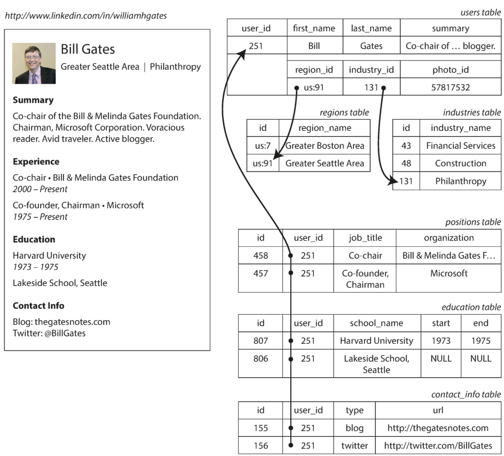
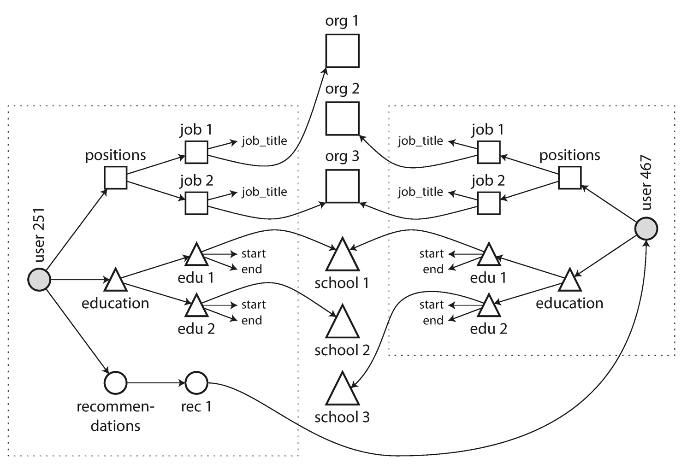

- In this chapter we will see what are data models, what are different types of models are used to design application, pros and cons of each models, etc.
- The term **_DATA MODEL_** refers to the way data is organized, documented and defined within a database.
- Most application are built by different layers. Each layer is a different data model. For each layer, the key question is: how is it represented in terms of the next-lower layer?
- For example:
  1.  Application developer looks real worlds and models it in terms of objects or data structure, and APIs that manipulate those data structure. -> Most developer are on this layer (said by Sunny not me)
  2.  Expressing the data structure in terms of a general-purpose data models, such as JSON or XML documents, tables in relation db or different models
  3.  Gigachads who build your database software decided on a way of representing that JSON/XML/relation/graph in terms of bytes in memory,disk or on network. Iski help se we can query,search, manupilate and process data in various ways
  4.  Now, more Alpha gigachads are hardware engineers who has figured out how to represent bytes in terms of electrical currents, pulses of light, and more.
- Different types of data models in book:
  1.  Relational models : organizes data into tables (relations) consisting of rows (tuples) and columns (attributes), enabling structured storage and efficient retrieval
  2.  Document models : stores data as flexible, self-describing documents—typically in formats like JSON or XML—allowing for dynamic schemas and hierarchical structures
  3.  Graph-like models : structures data as nodes (entities) and edges (relationships), allowing for efficient representation and querying of interconnected information.
- **Relation V/S Document model:**
  - Relation model was proposed by Edgar Codd in 1970. Many people doubted whether it could be implemented efficiently. But, in mid 1980 SQL become tool of choice for most people.
  - In upcoming many years many different models came like network model and hierarchical model in 1970s and early 1980s, Object databases in late 1980s and early 1990s, XML database in early 2000s.
  - Each competitor to the relation model generated a lot of hype in its time, but it never lasted (because SQL is Kratos of Databases 💪🏻)
  - **_Birth of NoSQL_**
    - In 2010s a Twitter hashtag #NoSQL was trending for a meetup on open-source, distributed, nonrelational database. (it has been retroactively reinterpreted as *Not Only SQL*)
    - _This was how the NoSQL database was born._
    - NoSQL was having its own pros:
      1.  Greater and easily scalable.
      2.  Specialized query operations that are not supported by relation models
      3.  Desire for more dynamic & expressive data model
  - Polygot Persistence: Using nonrelational datastore within relational databases
  - **_Object-Relation Mismatch_**
    - The application we are developing uses object to store data of user, where as in DB we store in relational tables.
    - So, to avoid this impedance mismatch(disconnect between models) a translation layer is required.
    - ORMs (Object-relational mapping) frameworks reduce the amount of boilerplate code required for this translation layer.
    - Today's ORMs are so advance that they can perform the same task across different data models (ORMs examples: Java[Hibernate], JS[Prisma], Python[SQLAlchemy], GO[GORM])
    - For Example let's see how to store resume:
      - Relational: 
        - Here each profile has its unique identifier, `user_id`. Fields like `first_name` and `last_name` apper exactly once per user, so they have a seprate columns on the user table.
        - But, most people have more than one job, people may have varying number of periods of education and many more details can be more than one.
        - Thus, one-to-many relationship from user to these items. These can be represented as:
          1.  (Prior to SQL:1999) Most common ways is normalization. Put positions, education and contact information in separate tables, with a foreign key referencing to `users` table.
          2.  Newer SQL standards support structured types, XML, and JSON for multi-valued data storage, with querying/indexing in databases like Oracle, DB2, SQL Server, MySQL, and PostgreSQL.
          3.  Third option to encode jobs, education and contact info as a JSON or XML. Store then in text in db, and let application interpret its structure and content. (In this you typically cannot use the database to query for values inside that encoded column.)
      - Document:
        ```json
        {
          "user_id": 251,
          "first_name": "Bill",
          "last_name": "Gates",
          "summary": "Co-chair of the Bill & Melinda Gates... Active blogger.",
          "region_id": "us:91",
          "industry_id": 131,
          "photo_url": "/p/7/000/253/05b/308dd6e.jpg",
          "positions": [
            {
              "job_title": "Co-chair",
              "organization": "Bill & Melinda Gates Foundation"
            },
            { "job_title": "Co-founder, Chairman", "organization": "Microsoft" }
          ],
          "education": [
            { "school_name": "Harvard University", "start": 1973, "end": 1975 },
            {
              "school_name": "Lakeside School, Seattle",
              "start": null,
              "end": null
            }
          ],
          "contact_info": {
            "blog": "https://www.gatesnotes.com/",
            "twitter": "https://twitter.com/BillGates"
          }
        }
        ```
        - JSON representation offers better locality than a multi-table schema, needing just one query instead of multiple queries or complex joins.
  - **_Many-to-One and Many-to-Many Relationships_**
    - As we see in above example `region_id` and `industry_id` are given as Ids, not as plain-text. Because this help in:
      1. Consistenct style and spelling across profile
      2. Avoiding ambigutiy (like Banglore, Bengluru, Greater Bengluru Area)
      3. Ease of updating - all are stored in only one place, so easy to update
      4. Localization support — when the site is translated into other languages
      5. Better search — e.g., a search for Senior Director at JioHotstar you will get Sunny's Profile
    - This is help in cases when humans may need to change to be something and if the information is duplicated, all the redundant copies need to be updated.
    - Removing such duplication is the key idea behind normalization in databases.
    - Thus, normalizing this data require _many-to-one_ relationships, which don't fit nicely into document models.
    - Moreover, when adding new features (like Organization, schools, Recommendations, etc.) require _many-to-many_ relationships.
      
