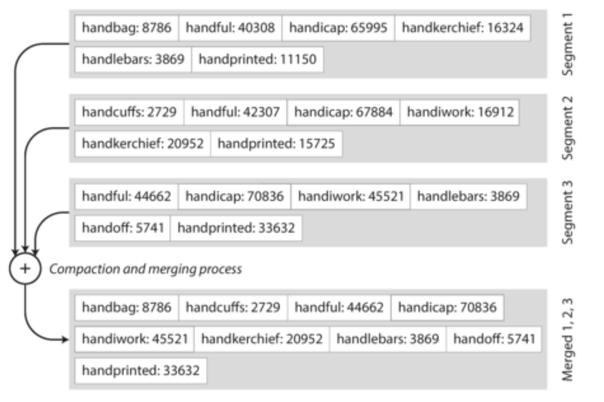

# Chapter 3

- In [Chapter 2](./Chapter2) we have discussed about data models and query language, the format in which give database your data, and the mecahnism by which you can ask for it again later.
- But, here we will discuss the same from database's POV: how we can store data that we've given, and how we can find it again when we're asked for it.
- The reason why we are understand what is to have a rough idea what is happening under the hood. This will help in understand which storage engine to use for our workload.

- ### **Data Structure That Power Your Database**

  - Let's implement world's simplest dataset using two _Bash_ functions:

    ```bash
    #!/bin/bash
    db_set(){
      echo "$1,$1" >> database
    }
    db_get(){
      grep "^$1", database | sed -e "s/^$1//," | tail -n 1
    }
    ```

  - These two function stores key - value pairs.
  - `db_set` will store key and value in very simple text file `database` where each line containes key-value pair, separated by a comma. `db_get` will reterive the value of the key from the `database`.
  - This database is very simple, for every call to `db_step` appends to the end of file, so if we want to update we won't overwrite it, just append and while `db_get` get the last occurrence of a key in a file.
  - Now our `db_set` function has pretty good performance as appending the file is very efficient.
  - But on other hand `db_get` function has terrible performance as it scan the entire database file from beginning to end. The cost of looking up will be O(n), for large databases it might take a lot of time.
  - To solve with we use different data structure an _index_. It is an additional structure that is derived from primary data.
  - But you might think using index can affect performance of writes as the index also need to update everytime data is written.
  - This is an important trade-off in storage system, as well chosen index speed-up read operations. For this reason we don't usually index everything by default, but you choose indexes manually, using your knowledge of app's typical query pattern.
  - **_Hash Indexes_**:
    - Considering our data is in key-values and data storage consists only of appending to a file.
    - Simplest possible indexing strategy is to store the byte offset of every key in a in-memory hash map.
    - For example our data is `{"name" : "London", "attration": ["Big Ben", "London Eye"]}` and `{"name" : "San Fransciszo", "attration": ["Golden Gate Bridge"]}` then it will store:
      
    - This might sound simplistic but it is viable approach used in _Bitcask_. Also using these we can load data with just one disk seek.
    - This kind a storage engine are well suited to situations where the values are frequently updating. But, with very few distinct keys.
    - So, to index them we perform a _Compaction process_. Compaction means throwing away duplicate keys, and keeping only the latest update of each key.
      
    - Now, since segments are smaller we can merge two segment.
      
    - The merging and compactions can run on background thread, as we can still read the data from old segments. Once merged we switch read request to new segment and simply delete the old segment.
    - Each segments has it own in-memory hash table. In order to find we check in most recent segment, if not there then 2nd most recent, and so on.
    - To implement this simple idea we have to take care of following issues:
      1. _File format_: Instead of CSV, binary format is better.
      2. _Deleting records_: Append key and value you want to delete to special deletion records aka _tombstone_. Tombstone tells merging process to discard any previous value for the deleted key.
      3. _Crash recovery_: Naive approach is when in-memory as crash start again with reading the segment. This might take long time so Bitcask improved it by taking a snapshot of each segment's hashmap, which can be loaded into memory more quickly.
      4. _Partially written records_: To solve this issue Bitcask files include checksum.
      5. _Concurrency control_: Only one writer thread and as data file segments are append-only read concurrently with multiple threads.
    - Pros:
      - Appending and segment merging are sequential write operations are generally much faster than random writes to hard disks.
      - Concurrency and crash control are much simpler.
      - Merging old segments avoids problems of data fragmentation over time.
    - Cons:
      - Hash table must fit in memory.
      - Range queries are not efficient. For example searching for value of keys from 2-12.
  - **_SSTables and LSM-Trees_**:

    - In above figure we saw that each segments store key-values pairs in order that they were written. Apart from that, the order of key-value pair does not matter.
    - Now, what if we for every new write in the segment, store the key-value pair in sorted order by key. We call this format _Sorted String Table_ or _SSTable_.
    - SSTables has several advantages over log segments with hash indexes:
      1. Merging segments is simple and efficient, even if the file are bigger than available memory. Just apply _mergesort algorithm_, this produces a new merged segment file, also sorted by key. If the same key appears in several input segment, it means different value were written to the database at different time, with each segment containing all the value from a specific time period. We can keep the value from the most recent segment and discard value in older segments.
         
      2. You no longer need to keep an index of all the keys in memory. Instead, store some offsets for some of the keys that can lead you to the SSTables on disk for other keys between those offsets. Check the below figure for better understanding.
         
      3. Since read requests scan over multiple key-value pairs within a requested range, to reduce the I/O bandwidth required for disk seeks, group those records into a block and compress it before writing to the disk. Check above figure's shaded area
      - **Constructing and maintaining SSTables**:
        - As our incoming writes can occur in any order, maintainig a sorted structure on disk is possible using Trees especially red-black or AVL trees(these tree provides sorting while inserting).
        - Now our storage engine works as follow:
          - Write comes in, added to red-black tree. This in-memory tree is called a _memtable_.
          - When memtable hits a threshold, lets say 5MB it writes out to disk as an SSTable file. As tree as all key-value pairs in sorted format this will be done efficiently. The new SSTable file is the most recent segment and while SSTable is begin written out to disk, writes continues to a new memtable.
          - Server a read request, first find key in memtable, then in most recent on-disk segment, then in the next-older segment, etc.
          - Run merging and compaction process time to time in background to combine segment file.
        - This scheme works well but the only issue arise when the database crashes, the most recent writes (values in memtable) are lost. To avoid that problem, keep a separate log on disk to which every write is immediatelty appended. Every time the memtable is written out to an SSTable, the corresponding log can be discarded.
      - **Making an LSM-Tree out ot SSTable**:
        - LevelDB and RocksDB, key-value storage engine libraries, use this algorithm to efficiently store data.
        - Similar storage engines, such as those used in Cassandra, HBase, and Riak, were inspired by Google's Bigtable paper.
        - The algorithm is based on Patrick O’Neil et al.'s _Log-Structured Merge-Tree (LSM-Tree)_ concept, which builds on earlier work on log-structured filesystems.
        - LSM storage engines like LevelDB and RocksDB compact and merge sorted SSTables to improve performance and reduce I/O operations.
        - Lucene, an indexing engine for full-text search used in Elasticsearch and Solr, also uses a similar approach to store its term dictionary.
      - **Performance Optimization**:
        - Still there are some area where we need might not have good performance.
        - LSM-tree algorithm can be slow when looking up keys that don't exist in the database; you check the memtable, then the segment all the way back to the oldest before you can be sure that the key does not exist.
        - To optimize this kind of access, storage engine often use additional _Bloom filters_.
        - Compaction and merging involve various strategies for determining order and timing:
          - Size-tiered compaction: newer and smaller SSTables are successively merged into older and larger SSTables.
          - Level-tiered compaction: key range is split up into smaller SSTables and older data is moved into separate "levels".

  - **_B-Trees_**:
  - **_Comparing LSM-Trees and B-Trees_**:
  - **_Other Indexing Structures_**:

- ### **Transaction Processing or Analytics?**

- ### **Column-Oriented Storage**
