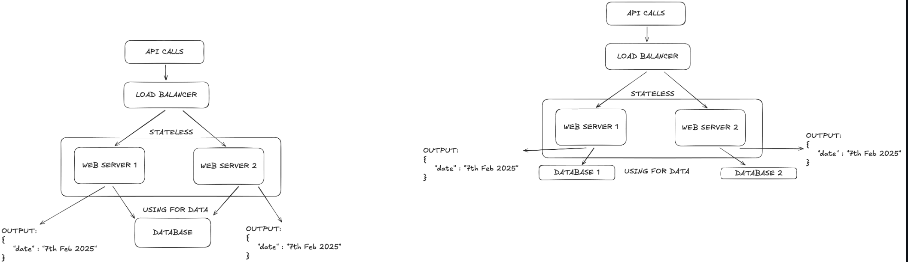
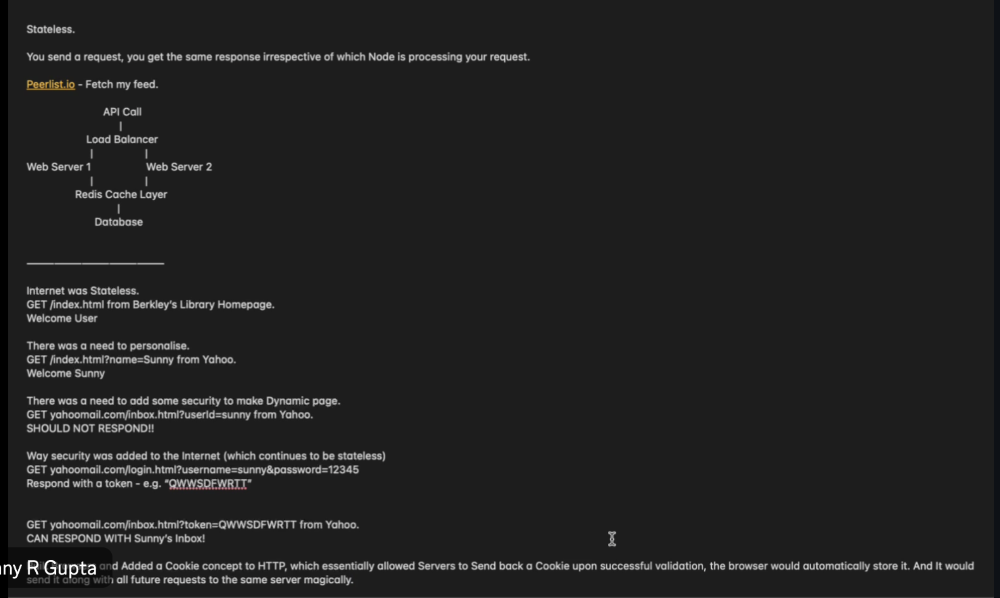

# 7th Feb Notes:

- Tail latency amplification:
- rolling window -> used to show analytics of website's performs (avg of response time of request in last x mins/secs)
- explore forward decay, t-digest, HdrHistogram (used in DSA and also help in calculating approx percentile of minimum CPU usage the the )

## Approached for Coping with Load:

- just because vertical and horizontal scaling does exist but kabhi that can be more expensive. So, be thoda chindi and try distributing user load this is also know as shared-nothing architecture.
- system are Elastic means that they can automatically add computing resource when they detect a load increase, some other system are scaled manuallly by a human.
- Remeber elastic does not means always automatic, sometime hybrid scalling is also know as elastic. JioCinema uses hybrid scaling during IPL and world cups

- Stateless : You send a request, you get the same response irrespective of which Node is processing your request
- Example of stateless architecture:
  

- Issues with stateless:
  

- Research about why internet is stateless

## Matainability

- Apna code ese likho ki for next 20 years it works smoothly
- And remember don't change your code just because there are new way of doing the same task. Rather than that focus on creating new feature
- Main focus for maintainability has 3 design principle for software system:
  1.  Operability:
      - Make it easy for operations teams to keep the system running smoothly
  2.  Simplicity:
      - Make it easy for new engineer to understand the system.
      - Document every to changes you do and passover the document when you leave that company/project
  3.  Evolvability:
      - Design system to adapt to changing requirements over time. - Focus on architectural flexibility and modular design for easy updates.
- Operation team are vital to keep a system running
- They help in:
  - Monitoring the health of system
  - tracking down the cause of problem, such as system failure
  - keep system up to date like security patches
  - anticipating future problems and solving them
- good operability means making routine task easy allowing the operation team to focus on their high value tasks:
